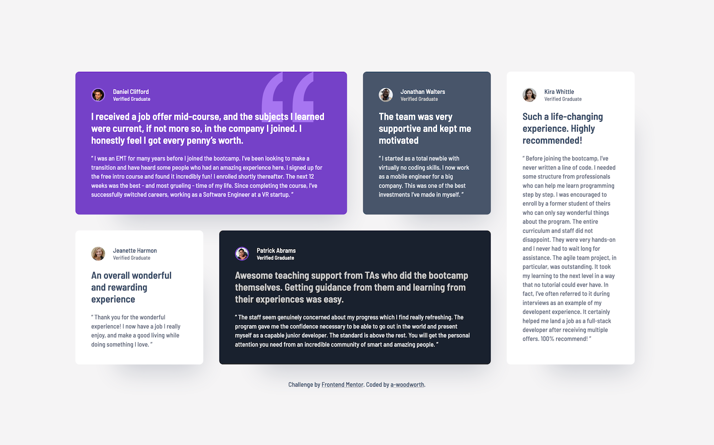
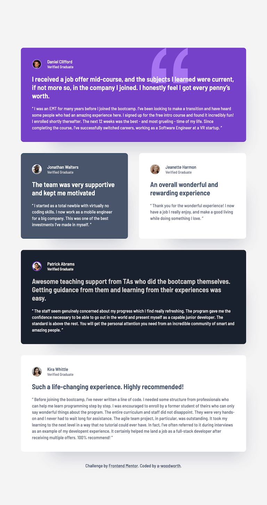

# Frontend Mentor - Testimonials Grid Section Solution

This is a solution to the [Testimonials grid section challenge on Frontend Mentor](https://www.frontendmentor.io/challenges/testimonials-grid-section-Nnw6J7Un7).

## Table of contents

- [Overview](#overview)
  - [The challenge](#the-challenge)
  - [Screenshots](#screenshots)
  - [Links](#links)
  - [Built with](#built-with)

## Overview

### The challenge

Users should be able to:

- View the optimal layout for the site depending on their device's screen size

### Screenshots

**Desktop**

**Tablet**

**Mobile**

### Links

- Solution URL: [Solution]()
- Live Site URL: [Live Site](https://a-woodworth.github.io/testimonials_grid_section)

### Built with

- Semantic HTML5 markup
- CSS Custom properties (variables)
- Flexbox
- CSS Grid
- [Sass](https://sass-lang.com) - CSS Preprocessor
